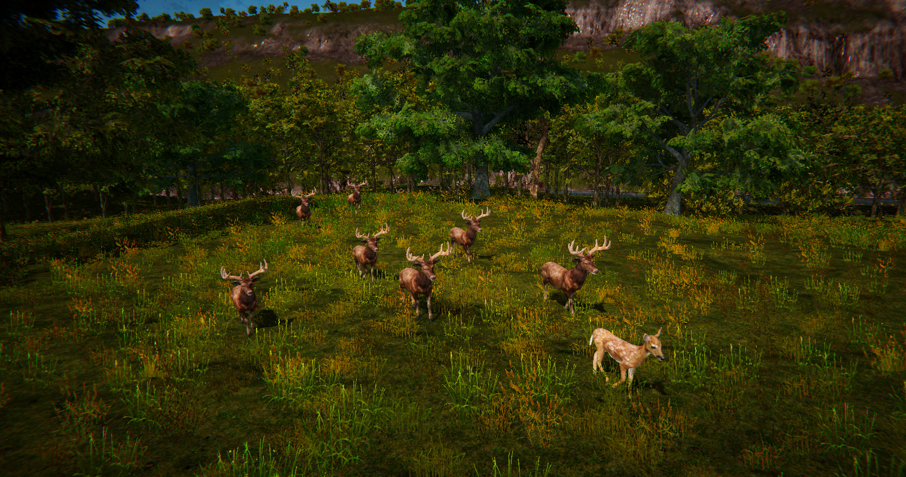

# Authoring Consistent Landscapes with Flora and Fauna

This repository contains the source code of the paper: **Authoring Consistent Landscapes with Flora and Fauna**. Pierre Ecormier-Nocca, Guillaume Cordonnier, Philippe Carrez, Anne-Marie Moigne, Pooran Memari, Bedrich Benes, Marie-Paule Cani. ACM Transactions on Graphics, Association for Computing Machinery, 2021.



## Dependencies

The code was tested on Ubuntu 20.04 LTS and Windows 10, but should also run on MacOSX without issues.

The project runs on `python3` and the following packages: `matplotlib numpy numba scipy skimage opencv-python`. First, please make sure that `python3` and `pip` are installed. On linux:

```shell
sudo apt-get install python3 python3-pip
```

The dependencies can then be installed by running the `install-deps.py` file, or by installing them manually via pip:

```shell
python3 -m pip install matplotlib numpy numba scipy scikit-image opencv-python
```

The illumination precomputation can be done on the GPU if you have CUDA installed and configured. See `conditions.py` for this.

## Running the project

Running `run.py` executes the project and generates output figures in `resources/tautavel_J/visu`.

The interactive 3D visualization of the result is not included in this repository.

## Citation

```bibtex
@article{authoringconsistentlandscapes21,
    author = {Ecormier-Nocca, Pierre and Cordonnier, Guillaume and Carrez, Philippe and Moigne, Anne-Marie and Memari, Pooran and Benes, Bedrich and Cani, Marie-Paule},
    title = {Authoring Consistent Landscapes with Flora and Fauna},
    year = {2021},
    issue_date = {August 2021},
    publisher = {Association for Computing Machinery},
    address = {New York, NY, USA},
    volume = {40},
    number = {4},
    issn = {0730-0301},
    url = {https://doi.org/10.1145/3450626.3459952},
    doi = {10.1145/3450626.3459952},
    journal = {ACM Trans. Graph.},
    month = jul,
    articleno = {105},
    numpages = {13}
}
```

## License

The code is released under MIT License. See LICENSE for details.
